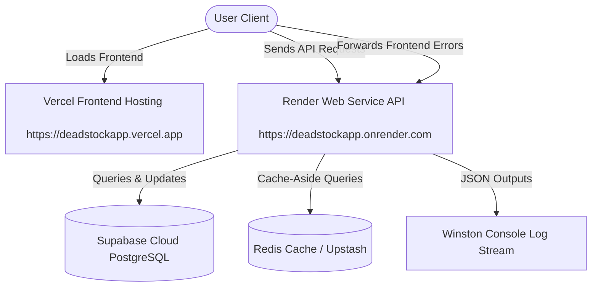

<div align="center">

# 🏢 DeadStockApp - Online Dead Stock Register

> A modern, production-ready enterprise asset lifecycle and dead stock management system built with Express, React (Vite/TS), PostgreSQL (Supabase), and Redis.

[](https://deadstockapp.vercel.app)
[](https://deadstockapp.onrender.com)
[](https://supabase.com/)
[](https://opensource.org/licenses/MIT)

</div>

---

## 📖 Table of Contents
1. [Project Overview & Purpose](#-project-overview--purpose)
2. [Key Features](#-key-features)
3. [Technology Stack](#-technology-stack)
4. [System Architecture](#-system-architecture)
5. [Monorepo Directory Structure](#-monorepo-directory-structure)
6. [Prerequisites & System Requirements](#-prerequisites--system-requirements)
7. [Environment Variables Guide](#-environment-variables-guide)
8. [Database Setup & Schema DDL](#-database-setup--schema-ddl)
9. [Local Development Installation](#-local-development-installation)
10. [Development Workflow & Commands](#-development-workflow--commands)
11. [Testing & Quality Gates](#-testing--quality-gates)
12. [Production Build & Deployment Guide](#-production-build--deployment-guide)
13. [Vercel & Render MCP Server Integrations](#-vercel--render-mcp-server-integrations)
14. [Security Best Practices](#-security-best-practices)
15. [Performance Optimization](#-performance-optimization)
16. [Backup, Recovery, & Troubleshooting](#-backup-recovery--troubleshooting)
17. [Contribution Guidelines & Coding Standards](#-contribution-guidelines--coding-standards)
18. [License](#-license)

---

## 🌟 Project Overview & Purpose
**DeadStockApp** (Online Dead Stock Register) is an enterprise-grade solution designed to catalog, track, transfer, audit, and dispose of institutional assets and dead stock (scrap, obsolete, or non-functional items). 

### The Problem
Large organizations often struggle with:
* Lack of visibility into underutilized assets, leading to redundant purchases.
* Cumbersome manual asset audits and transfers.
* Inefficient procedures for scraping or writing off obsolete hardware and equipment.
* Missing history trails or audit trails for compliance validation.

### Our Solution
DeadStockApp automates this lifecycle by introducing role-scoped access control, QR-based scanning, automated request workflows, and audit trail generation, ensuring cost savings and compliance at every step.

---

## ✨ Key Features

* 🔐 **Role-Based Access Control (RBAC)**: Distinct permissions for `ADMIN`, `INVENTORY_MANAGER`, `IT_MANAGER`, `AUDITOR`, and `VENDOR`.
* 📦 **Asset Lifecycle Tracking**: From purchase orders, invoices, and cataloging to maintenance, scrap status, and disposal.
* 📱 **QR Code System**: Fully integrated camera scanning and QR label generation for quick in-field asset inspections.
* 🔄 **Multi-Level Approvals**: Multi-step verification workflow for inter-department transfers and disposal write-offs.
* 📊 **Role-Specific Dashboards**: Custom dashboards designed for each user's operational scope (e.g., read-only sheets for Auditors).
* 📝 **Compliance Audit Logging**: Comprehensive, automated history tracking for every update or transaction.
* 🚀 **Telemetry & Winston Ingestion**: Robust JSON console logging in production with client unhandled error forwarding.
* 🗄️ **Cache-Aside Caching**: High-performance category querying backed by Redis caching.

---

## 🛠️ Technology Stack

### Frontend Client
* **Core**: React 18.2 with TypeScript, built on **Vite** for fast HMR.
* **State Management**: Redux Toolkit & TanStack Query (React Query).
* **Styling**: Tailwind CSS & Material-UI (MUI) components.
* **Forms**: React Hook Form & Yup schema validation.
* **Charts**: Recharts & Chart.js for interactive analytics dashboards.
* **E2E Testing**: Playwright for end-to-end user flow verification.

### Backend API
* **Runtime**: Node.js & Express.js.
* **Database**: PostgreSQL hosted on **Supabase Cloud**.
* **Cache**: Redis for category list caching.
* **Logger**: Winston (colorized dev format, structured JSON prod format).
* **Authentication**: JWT (JSON Web Tokens) with cryptographically secure signatures.
* **API Documentation**: Interactive Swagger UI endpoints.
* **Testing**: Jest & Supertest for integration test runners.

---

## 🗺️ System Architecture

The following diagram illustrates how the frontend, API service, database, cache, and telemetry systems communicate:



---

## 📁 Monorepo Directory Structure

The project is structured as a monorepo with separate root-level folder domains:

```
Online-Dead-Stock-Register/
├── frontend/                     # React Vite TypeScript frontend
│   ├── src/
│   │   ├── components/           # Shared & layout components (ErrorBoundary, Sidebar)
│   │   ├── context/              # App contexts (AuthContext)
│   │   ├── pages/                # Pages grouped by role-based routing directories
│   │   ├── utils/                # Utility helpers (logger.ts client telemetry)
│   │   └── App.tsx               # Main routing tree and provider wrappers
│   ├── tests/                    # Playwright end-to-end integration tests
│   ├── package.json              # Frontend package settings
│   └── vite.config.ts            # Vite build configuration
│
├── backend/                      # Node.js Express API backend
│   ├── config/                   # Configuration adapters (db.js, redis.js)
│   ├── controllers/              # Business controllers (auth, assets, logs)
│   ├── database/                 # SQL DDL schemas and migration verifiers
│   ├── middleware/               # Auth, security, and log rate-limiter rules
│   ├── routes/                   # Router mount definitions (logRoutes.js, api routes)
│   ├── tests/                    # Backend Jest integration tests
│   ├── utils/                    # Winston logger core config
│   ├── server.js                 # Express server bootstrap entry point
│   └── package.json              # Backend package configuration
│
├── vercel.json                   # Vercel Monorepo build and SPA routing config
└── README.md                     # This master documentation
```

---

## ⚙️ Prerequisites & System Requirements

Ensure your development machine has the following tools installed:

| Software | Version | Purpose |
| :--- | :--- | :--- |
| **Node.js** | `>= 18.2.0` | Runtime environment for frontend/backend scripts |
| **npm** | `>= 9.0.0` | Package manager |
| **Git** | `>= 2.30.0` | Version control |
| **PostgreSQL** | `v15 / v16` | Database engine (managed by Supabase) |
| **Redis** *(Optional)* | `>= 6.0` | In-memory cache layer |

---

## 🔑 Environment Variables Guide

Environment variables are loaded automatically from `.env` files in development. 

### Backend Environment Configuration
Create **[backend/.env](file:///D:/Keval/Online-Dead-Stock-Register/backend/.env)** matching the template in **[backend/.env.example](file:///D:/Keval/Online-Dead-Stock-Register/backend/.env.example)**:

```ini
# Server Mode & Port
NODE_ENV=development
PORT=5000
FRONTEND_URL=http://localhost:5173
ALLOWED_ORIGINS=http://localhost:5173,http://localhost:3000,https://deadstockapp.vercel.app

# Supabase PostgreSQL connection
SUPABASE_URL=https://your-project.supabase.co
SUPABASE_PUBLISHABLE_KEY=your_supabase_anon_key
SUPABASE_SECRET_KEY=your_supabase_service_role_key
SUPABASE_JWKS_URL=https://your-project.supabase.co/auth/v1/.well-known/jwks.json

# Auth Cryptography Secret
JWT_SECRET=your_32_character_hex_string

# Caching (Redis)
REDIS_ENABLED=false # Set to true to enable Redis
REDIS_URL=redis://127.0.0.1:6379

# Logging
LOG_LEVEL=debug # debug, info, warn, error
TIMEZONE=UTC
```

### Frontend Environment Configuration
Create **[frontend/.env](file:///D:/Keval/Online-Dead-Stock-Register/frontend/.env)** matching the template in **[frontend/.env.example](file:///D:/Keval/Online-Dead-Stock-Register/frontend/.env.example)**:

```ini
VITE_NODE_ENV=development

# Leave VITE_API_BASE_URL blank in local development to use Vite's built-in 
# proxy (which automatically forwards /api to http://localhost:5000)
VITE_API_BASE_URL=
```

---

## 🗄️ Database Setup & Schema DDL

The database contains **24 verified tables** that manage users, assets, approvals, transactions, audit logs, and more. 

### Database Schema Structure
The official, consolidated database schema is kept in **[backend/database/schema.sql](file:///D:/Keval/Online-Dead-Stock-Register/backend/database/schema.sql)**.

To import or reset your database, run the SQL commands in `schema.sql` inside your PostgreSQL client or Supabase SQL Editor.

### Verifying Your Live Schema
An automated checker script is included in the project to verify that your active database schema matches the required definition. To run the verification checks:

```bash
cd backend
node database/verify_schema.js
```
The script will output `PASS` for all 24 tables if your Supabase schema is completely compliant and ready.

---

## 🚀 Local Development Installation

Follow these steps to set up the project locally:

### 1. Clone the Repository
```bash
git clone https://github.com/kevallathiya-74/Online-Dead-Stock-Register.git
cd Online-Dead-Stock-Register
```

### 2. Configure Environment Files
Copy the example templates to their active env paths:
```bash
# Set up backend env
cp backend/.env.example backend/.env

# Set up frontend env
cp frontend/.env.example frontend/.env
```
*Open `backend/.env` and fill in your actual Supabase URL and service role keys.*

### 3. Install Dependencies
Install all package dependencies for the monorepo from the root directory:
```bash
npm install
```
*(This triggers the root `postinstall` script, downloading packages for both the root workspace and the frontend/backend subdirectories).*

### 4. Seed Database Users
Run the user seeder to create test accounts:
```bash
cd backend
node seed/seedUsers.js
```

---

## 💻 Development Workflow & Commands

Use the following commands during active development:

### Running the Services Locally

#### 1. Start the Backend API
```bash
cd backend
npm run dev
```
*Runs the server on `http://localhost:5000`. Swagger documentation is mounted at `http://localhost:5000/api-docs`.*

#### 2. Start the Frontend Client
```bash
cd frontend
npm run dev
```
*Launches Vite on `http://localhost:5173`. Proxies `/api` routes locally to port `5000`.*

---

## 🧪 Testing & Quality Gates

The project maintains high standards of code quality and includes test runners and validation tools.

### 1. Run Backend Integration Tests
We use Jest for unit and integration testing:
```bash
cd backend
npm test
```

### 2. Run TypeScript Verification
Verify there are 0 compilation errors across the frontend:
```bash
cd frontend
npx tsc --noEmit
```

### 3. Pre-commit Hooks
The project has a pre-commit check file located at `.git/hooks/pre-commit` to prevent committing code that fails test or TypeScript checks. Make sure the hooks are executable:
```bash
chmod +x .git/hooks/pre-commit
```

### Default Credentials for Development Testing:

| Role | Email | Password |
| :--- | :--- | :--- |
| **Admin** | `admin@test.com` | `admin123` |
| **Inventory Manager** | `inventory@test.com` | `inventory123` |
| **IT Manager** | `it.manager@test.com` | `itmanager123` |
| **Auditor** | `auditor@test.com` | `auditor123` |
| **Vendor** | `vendor@test.com` | `vendor123` |

---

## 🚀 Production Build & Deployment Guide

To deploy the project live in production, follow these platform-specific setup procedures:

### Frontend Deployment (Vercel)
The project is configured for Vercel deployment with the domain **`deadstockapp.vercel.app`**.

1. Connect your repository to **Vercel**.
2. Vercel will automatically read the root-level **[vercel.json](file:///D:/Keval/Online-Dead-Stock-Register/vercel.json)**.
3. Configure the **Environment Variables** in Vercel settings:
   * `VITE_NODE_ENV` = `production`
   * `VITE_API_BASE_URL` = `https://deadstockapp.onrender.com/api/v1`
4. Deploy the project. The build outputs will be compiled and hosted at your Vercel URL.

### Backend Deployment (Render)
The Express backend is hosted at the URL **`https://deadstockapp.onrender.com`**.

1. Create a **Web Service** on Render pointing to your repository.
2. In Render configuration, set:
   * **Root Directory**: `backend`
   * **Build Command**: `npm install`
   * **Start Command**: `node server.js`
3. Add your production environment variables to Render's **Environment Dashboard** (e.g. `SUPABASE_URL`, `SUPABASE_KEY`, `JWT_SECRET`, and `ALLOWED_ORIGINS=https://deadstockapp.vercel.app`).
4. Save and build the service.

---

## 🔌 Vercel & Render MCP Server Integrations

Model Context Protocol (MCP) servers are configured for this project to allow AI coding tools (such as Claude Code or Cursor) to manage your production infrastructure safely.

### Configured remote servers:
* **Vercel MCP**: `https://mcp.vercel.com` (Tracks deployments, build configs, and analytics).
* **Render MCP**: `https://mcp.render.com/mcp` (Monitors logs, server metrics, databases, and variables).

The local config file containing these connections is **[opencode.json](file:///D:/Keval/Online-Dead-Stock-Register/opencode.json)**. 

> [!WARNING]
> Keep `opencode.json` secure. It contains API keys that permit remote access to your workspaces. This file is ignored from git tracking in `.gitignore`.

---

## 🔒 Security Best Practices

1. **Service Role Keys**: Never expose your Supabase `service_role` (secret) key to the frontend client. This key bypasses Row-Level Security (RLS).
2. **CORS Whitelist**: Always secure the `ALLOWED_ORIGINS` environment variable in production. Do not permit `*` origins; target only `https://deadstockapp.vercel.app`.
3. **Ingestion Rate-Limiting**: The backend client logging ingestion route `/api/v1/logs` is rate-limited (30 logs/min per IP) to prevent log-flooding Denial of Service (DoS) attempts.
4. **Token Expiry**: Configure your JWT tokens to expire within short durations (e.g., `24h`) and require re-authentication.

---

## ⚡ Performance Optimization

* **Redis Caching**: Enable Redis caching (`REDIS_ENABLED=true`) in production to cache category structures, reducing query load on Supabase.
* **Asset Query Pagination**: All asset and transaction lists leverage offset-based pagination to prevent heavy memory utilization.
* **Frontend Queue Ingestion**: Client unhandled errors are compiled and buffered locally in a client queue, then periodically sent in batches to prevent network congestion.

---

## 🛠️ Backup, Recovery, & Troubleshooting

### Database Backups
* **Supabase automated backups**: Enable automatic daily backups in your Supabase project dashboard settings.
* **Manual SQL dumps**: Run the pg_dump command to extract a database snapshot manually:
  ```bash
  pg_dump -H your-project.supabase.co -U postgres -d postgres > backup.sql
  ```

### Common Troubleshooting Issues
* **Vercel Build Fails (Missing package.json)**:
  Make sure you have a root `package.json` with the `"postinstall"` script configured. Vercel requires this root descriptor in monorepos to download sub-folder dependencies.
* **CORS Blocked Errors**:
  If the frontend receives CORS errors, check that `ALLOWED_ORIGINS` in your backend `.env` contains the exact URL of your Vercel deployment (e.g. `https://deadstockapp.vercel.app`), without a trailing slash.
* **Redis Connection Refused**:
  If you are running the backend without local Redis, verify `REDIS_ENABLED` is set to `false` in `.env` to fall back to in-memory caching.

---

## 🤝 Contribution Guidelines & Coding Standards

We welcome contributions! Please follow our styling and version control rules:

### Git Commit Conventions
We follow **Conventional Commits**:
* `feat: add category filter to asset list` (For new features)
* `fix: prevent token verification crash on empty header` (For bugs)
* `docs: update deployment guidelines` (For documentation)
* `refactor: clean up dashboard controller conditional logic` (For structure changes)

### Coding Standards
* **JavaScript/TypeScript**: Enforced via ESLint. Run `npm run lint` in folders before committing.
* **CSS/Styling**: Use Material-UI themes or Tailwind CSS. Avoid writing inline styling structures.

---

## 📄 License

This project is licensed under the MIT License. See the [LICENSE](file:///D:/Keval/Online-Dead-Stock-Register/LICENSE) file for details.
