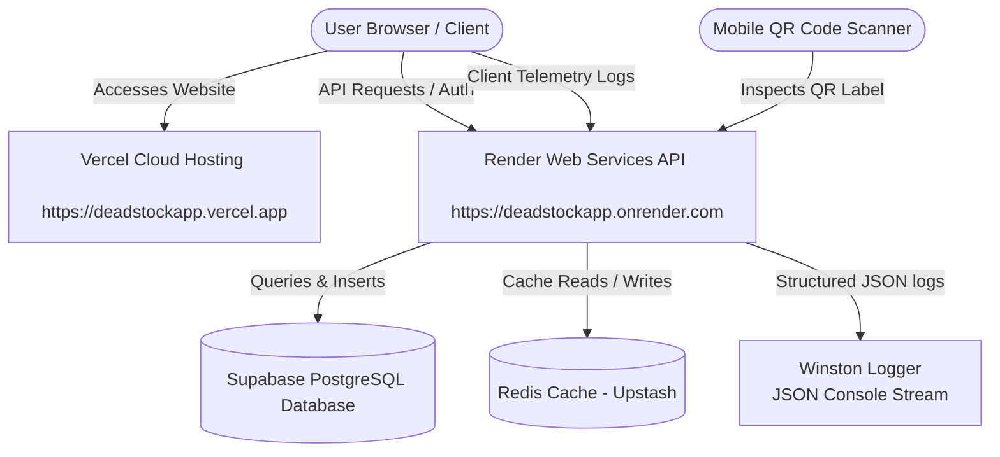
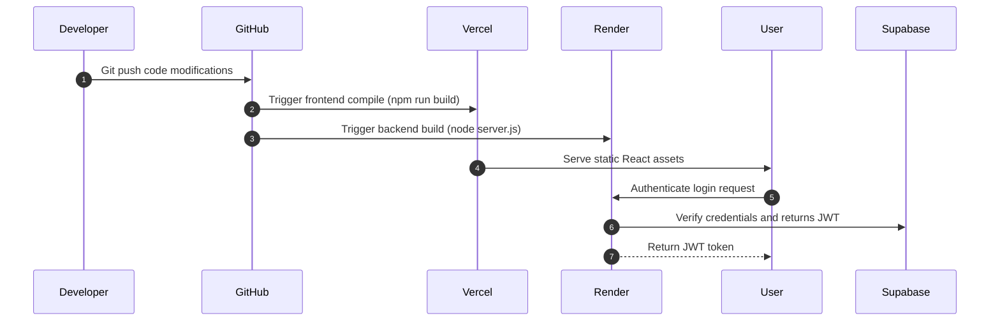

# 🏢 DeadStockApp - System Architecture

This document describes the architectural layout, data flow, and components of **DeadStockApp** (Online Dead Stock Register).

---

## 1. High-Level Architecture Diagram

The system follows a decoupled frontend-backend architecture with a cloud-managed database and caching layer:

---

## 2. Component Layout

### 📱 Frontend Layer (Vercel)
* **Framework**: React 18.2 with TypeScript, bundled using **Vite**.
* **Router**: React Router v6 enforcing role-based access route guards.
* **State Management**: Redux Toolkit for active sessions + TanStack Query (React Query) for API endpoints caching.
* **Security & Analytics**:
  * **Vercel Analytics**: Tracking user interactions and page traffic.
  * **Client Logger**: Batches unhandled runtime exceptions and forwards them asynchronously to the backend log ingestion service.

### ⚙️ Backend Layer (Render)
* **API Engine**: Express.js server hosted in a Node.js environment.
* **Middleware Framework**:
  * **CORS**: Domain-level whitelist restrictions.
  * **Helmet**: Standard HTTP security headers.
  * **Auth**: Custom JWT extraction and validation middleware verifying roles.
  * **Log Rate-Limiting**: Restricts log ingestion client calls to prevent DoS.
* **Telemetry Winston Logger**: Structured JSON formatting outputted directly to `Console` (stdout) for unified telemetry integration.

### 🗄️ Database & Storage Layer (Supabase)
* **PostgreSQL Engine**: Handles relational structures across 24 verified tables.
* **Row-Level Security (RLS)**: Protects tables from anonymous operations.
* **Database Connection Manager**: Connected securely using the `pg` connection pool.

### ⚡ Cache-Aside Caching Layer (Redis)
* **Storage**: In-memory Redis cache.
* **Workflow**:
  * On Category requests, the system queries Redis.
  * If missing, it falls back to Supabase, returns the values, and populates the cache with a predefined TTL.
  * On creation, update, or deletion, the Category cache key is automatically invalidated.

---

## 3. Deployment Flow

