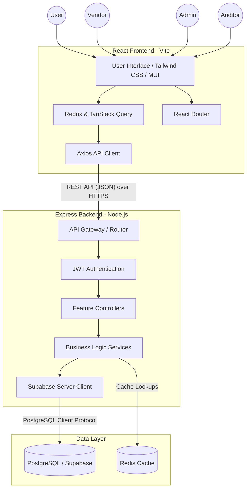
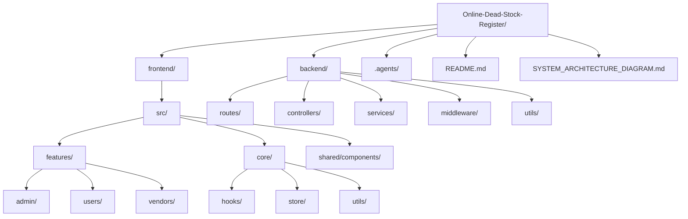
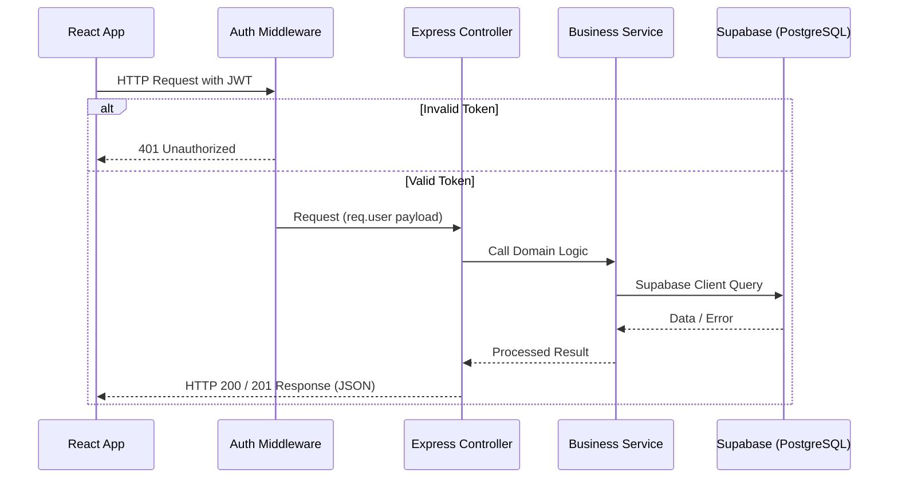
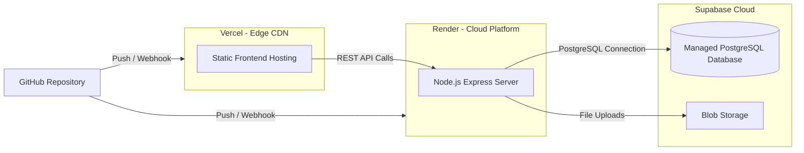

# System Architecture

This document provides a high-level overview of the Online Dead Stock Register's architecture, demonstrating the strict separation of concerns through our monorepo structure and the use of our Supabase (PostgreSQL) data layer.

## High-Level Architecture

The system follows a modern client-server architecture with a strict separation between the React frontend and the Express backend, backed by Supabase for the database layer.

## Monorepo Directory Structure

The project has been reorganized into an enterprise-grade monorepo to isolate environments and simplify deployments.

## Security & Data Flow

## Deployment Architecture

