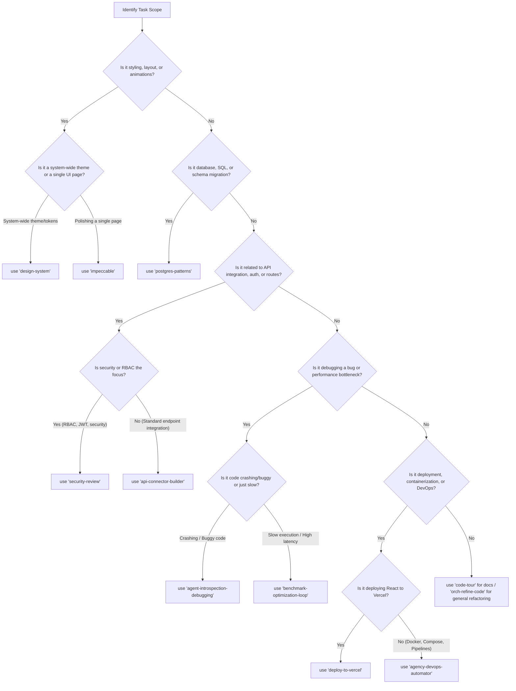

# Agent Skills Reference Manual & Inventory

Welcome to the **Agent Skills Reference Manual & Inventory** for the Online Dead Stock Register project. This document serves as a comprehensive, production-grade guide to the **463 agent skills** available under the `.agents/` customizations directory.

This guide is structured to help developers and AI agents immediately identify the correct skill for any development task, understand its scope, and execute it efficiently using **ready-to-use prompt templates**.

---

## 1. Skill Categories Overview

The 463 directory junctions under `d:\Keval\Online-Dead-Stock-Register\.agents\skills` are organized into the following major categories:

1. **`agency-roles` (184 Skills)**: Specialized persona-based agent roles (e.g., `agency-software-architect`, `agency-frontend-developer`, `agency-compliance-auditor`).
2. **`engineering` (74 Skills)**: Coding standards, database patterns, and framework-specific guidelines (e.g., `backend-patterns`, `postgres-patterns`, `database-migrations`, `hexagonal-architecture`).
3. **`ai-and-agents` (28 Skills)**: Context management, autonomous execution patterns, and agent self-debugging (e.g., `agentic-engineering`, `agent-introspection-debugging`, `continuous-agent-loop`).
4. **`design-and-ui` (32 Skills)**: Styling rules, design systems, accessibility guidelines, and UI polishing (e.g., `design-system`, `impeccable`, `accessibility`, `motion-ui`).
5. **`security-and-compliance` (20 Skills)**: Security checklists, RBAC controls, and compliance tools (e.g., `security-review`, `security-scan`, `hipaa-compliance`, `safety-guard`).
6. **`tools-and-integrations` (6 Skills)**: Third-party API connectors and CLI managers (e.g., `jira-integration`, `vercel-cli-with-tokens`, `github-ops`).
7. **`vercel` (7 Skills)**: Vercel-specific deployment pipelines, Turbopack optimizations, and caching rules.
8. **`miscellaneous` (122 Skills)**: Code tours, search utilities, workflow accelerators, and translation tasks.

---

## 2. Core Skills Deep Dives & Prompt Templates

This section provides a deep dive into the **15 core skills** corresponding to the 15 critical development scenarios requested, complete with all 18 metadata fields and copy-paste prompt templates.

---

### Skill 1: Backend Bug Fixing (`agent-introspection-debugging`)

#### Metadata
* **Skill Name**: `agent-introspection-debugging`
* **Purpose**: Provide a structured, self-correcting debugging loop for resolving complex backend code failures, stack traces, and runtime exceptions.
* **Short Description**: Self-debugging wrapper that guides agents to capture errors, diagnose root causes, test recovery in isolation, and write post-mortem logs.
* **Detailed Explanation**: This skill enforces a strict debugging methodology: (1) Capture: retrieve the full error logs and context, (2) Diagnose: formulate hypotheses and check source files, (3) Contain: attempt targeted fixes in a isolated step, (4) Recover: run checks/tests, (5) Introspect: document why the bug happened.
* **Primary Responsibilities**: Parse stack traces, run diagnostic scripts, isolate error states, test regressions, check boundary conditions.
* **When to Use**: When a backend crash, database mismatch, or API failure occurs and the root cause is not immediately obvious.
* **When Not to Use**: For simple syntax errors or obvious import failures that can be fixed instantly.
* **Best Use Cases**: Unhandled exceptions, silent database transaction rollbacks, race conditions, memory leaks, and third-party API timeout crashes.
* **Inputs Expected**: Stack trace/error logs, path to the failing files, description of expected vs. actual behavior.
* **Outputs Produced**: Patched code files, passing test execution output, and a post-mortem debugging report.
* **Dependencies**: `postgres`, local server logs, terminal access for diagnostic commands.
* **Recommended Workflow**: Paste the stack trace $\rightarrow$ run server in dry-run mode $\rightarrow$ inspect code lines $\rightarrow$ propose fix $\rightarrow$ write regression test.
* **Best Practices**: Never make assumptions about the state; always print or inspect the exact variable value before applying a fix.
* **Common Mistakes to Avoid**: Patching the symptom (e.g., adding `try-catch` to hide the error) instead of resolving the root cause.
* **Related Skills**: `orch-fix-defect`, `error-handling`, `terminal-ops`.
* **Real-World Example**: Diagnosing why JWT signature validation fails randomly due to an improperly formatted environment variable.
* **Performance Considerations**: Minimize the use of heavy debugger processes; rely on targeted console/log inspection.
* **Limitations**: Requires reproducible logs or steps; cannot debug transient hardware/network-layer dropouts.

#### AI Prompt Template
```markdown
# Trigger: Backend Bug Fixing
# Skill Target: agent-introspection-debugging

I need you to debug a backend issue in our Express/Node.js application.

## Error Context
- **Symptom**: [Describe what is failing, e.g., POST /api/v1/auth/login returns 500]
- **Stack Trace / Logs**:
```
[Paste logs/stack trace here]
```
- **Relevant Files**:
  - `[File 1 Path](file:///D:/Keval/Online-Dead-Stock-Register/backend/...)`
  - `[File 2 Path](file:///D:/Keval/Online-Dead-Stock-Register/backend/...)`

## Instructions
1. Run a diagnostics step to check the state of the code and verify the file content.
2. Locate the line of code causing the crash or incorrect behavior.
3. Formulate a hypothesis for the root cause.
4. Propose a targeted fix without changing unrelated business logic.
5. Verify the fix by running a syntax check (`node -c`) or executing tests.
6. Provide a brief explanation of what caused the bug and how it was fixed.
```

---

### Skill 2: Frontend UI Improvements (`impeccable`)

#### Metadata
* **Skill Name**: `impeccable`
* **Purpose**: Audit and polish React UI components to achieve premium, state-of-the-art aesthetics, micro-animations, and visual consistency.
* **Short Description**: Design-centric auditing tool to enforce modern visual tokens, responsive layout, dark modes, and high-performance micro-interactions.
* **Detailed Explanation**: This skill focuses on frontend perfection. It reviews React (Vite/TS) layouts for spacing alignment, typography hierarchies, HSL color harmony, glassmorphism, responsive breakpoints, transitions, loading spinners, and empty states.
* **Primary Responsibilities**: Enhance CSS/Tailwind layouts, add Tailwind transitions, align grid/flex boxes, audit color contrast ratios, implement skeleton loaders.
* **When to Use**: When a UI page looks plain, is misaligned, lacks visual responsiveness, or needs a premium face-lift.
* **When Not to Use**: When building raw backend APIs or writing pure business logic.
* **Best Use Cases**: Styling dashboard statistics cards, landing pages, sidebar navigations, modal popups, and tables.
* **Inputs Expected**: React component source file, Tailwind config file, or design requirements.
* **Outputs Produced**: Polished React/CSS code, smooth transition styles, and an interactive UI audit report.
* **Dependencies**: Tailwind CSS version, `@heroicons/react`.
* **Recommended Workflow**: Inspect layout files $\rightarrow$ identify styling inconsistencies $\rightarrow$ adjust CSS tokens $\rightarrow$ run frontend dev server to preview $\rightarrow$ verify with compiler.
* **Best Practices**: Use theme colors (like CSS variables or Tailwind classes) instead of hardcoding raw HEX values.
* **Common Mistakes to Avoid**: Over-complicating layouts with excessive custom CSS instead of standard Tailwind utilities.
* **Related Skills**: `design-system`, `motion-ui`, `make-interfaces-feel-better`.
* **Real-World Example**: Redesigning a static table of dead stock into a glassmorphic list with hover effects and state badges.
* **Performance Considerations**: Avoid adding large animation libraries; prioritize lightweight CSS keyframes and transitions.
* **Limitations**: Relies on CSS capabilities; complex custom shaders require WebGL/Three.js skills.

#### AI Prompt Template
```markdown
# Trigger: Frontend UI Polishing
# Skill Target: impeccable

Please polish the UI layout of the following React component to make it look premium, modern, and visually engaging.

## Target Page/Component
- **Component File**: `[Component Name](file:///D:/Keval/Online-Dead-Stock-Register/frontend/src/...)`
- **Visual Goals**: [e.g., Add hover transitions, improve spacing, make the layout glassmorphic, add dynamic status badges]

## Instructions
1. Review the component markup and style classes.
2. Replace static borders/colors with premium gradients, clean shadows, and consistent border-radius tokens.
3. Add micro-interactions (e.g., hover scaling, slide transitions, click feedback).
4. Ensure full responsiveness across desktop, tablet, and mobile views.
5. Provide a summary of the layout improvements and a list of updated classes.
```

---

### Skill 3: API Integration (`api-connector-builder`)

#### Metadata
* **Skill Name**: `api-connector-builder`
* **Purpose**: Standardize the creation and connection of external/internal REST API endpoints between the React frontend and Express backend.
* **Short Description**: API connector generator that ensures uniform Axios configurations, error handling, typing, and route definitions.
* **Detailed Explanation**: This skill enforces the repository's API pattern: (1) Define TypeScript interfaces for requests/responses, (2) Implement Axios client instances with authorization header interceptors, (3) Create controller handlers with Express validation, (4) Map endpoints to proper route groups.
* **Primary Responsibilities**: Write Axios service callers, TypeScript interfaces, Express controllers, route definitions, and validation middlewares.
* **When to Use**: When adding a new integration (e.g. connecting a new page to a backend controller, or adding a vendor API).
* **When Not to Use**: For refactoring database schemas or writing pure UI styles.
* **Best Use Cases**: Connecting a frontend user profile form to the backend `/api/v1/users/profile` CRUD endpoints.
* **Inputs Expected**: API endpoint design (URL, method, headers), request body JSON schema, response body JSON schema.
* **Outputs Produced**: Frontend Axios services, backend routes, controllers, and validation files.
* **Dependencies**: `axios`, `express`, `express-validator`, `typescript`.
* **Recommended Workflow**: Write TS types $\rightarrow$ create backend route/controller $\rightarrow$ write Express validator $\rightarrow$ write frontend Axios client $\rightarrow$ test end-to-end.
* **Best Practices**: Always validate requests on the backend; never trust frontend inputs. Use consistent response envelopes (`{ success: true, data: ... }`).
* **Common Mistakes to Avoid**: Omitting authentication/RBAC middleware on the backend route file.
* **Related Skills**: `backend-patterns`, `security-review`.
* **Real-World Example**: Creating endpoints to upload vendor invoices, validate PDF files on the backend, and store references in Supabase.
* **Performance Considerations**: Compress JSON payloads; utilize pagination query parameters for list endpoints.
* **Limitations**: Limited by REST constraints; real-time push requires WebSockets.

#### AI Prompt Template
```markdown
# Trigger: API Integration
# Skill Target: api-connector-builder

I need you to integrate a new API endpoint linking the React frontend and Express backend.

## API Specifications
- **Endpoint**: [e.g., POST /api/v1/assets/:id/maintenance]
- **Role Permissions Required**: [e.g., ADMIN, INVENTORY_MANAGER]
- **Request Payload**:
```json
[Paste request JSON example here]
```
- **Response Payload**:
```json
[Paste response JSON example here]
```

## Target Directory/Files
- **Backend Controller/Routes**: `[Routes File](file:///D:/Keval/Online-Dead-Stock-Register/backend/routes/...)`
- **Frontend Service**: `[Axios Client File](file:///D:/Keval/Online-Dead-Stock-Register/frontend/src/services/...)`

## Instructions
1. Implement the Express controller validation using `express-validator` and add proper try/catch.
2. Protect the backend route with `authMiddleware` and `requireRole` guards.
3. Write the frontend API call function using the shared Axios client.
4. Declare TypeScript interfaces for the request and response structures.
5. Verify the integration compile output.
```

---

### Skill 4: Database Optimization (`postgres-patterns`)

#### Metadata
* **Skill Name**: `postgres-patterns`
* **Purpose**: Analyze, optimize, and maintain PostgreSQL database schemas, indexes, queries, and constraints (specifically tailored for Supabase).
* **Short Description**: Best practices for writing high-performance SQL, managing database schemas, indexing columns, and optimizing complex joins.
* **Detailed Explanation**: This skill guides database design: enforcing relational normalization, configuring foreign key cascade deletes, choosing appropriate indexes (B-Tree, GIN, GiST), writing raw SQL, and diagnosing slow queries with `EXPLAIN ANALYZE`.
* **Primary Responsibilities**: Write SQL migrations, create indexes, define foreign keys, write analytical queries, refactor schema relations.
* **When to Use**: When a page load is slow due to database query timeouts, or when creating new tables in Supabase.
* **When Not to Use**: For non-relational database tasks or simple frontend changes.
* **Best Use Cases**: Indexing the dead stock search parameters, optimizing transaction joins, and adding audit triggers.
* **Inputs Expected**: Slow query logs, Supabase schema file (`supabase-schema.sql`), table relationship structures.
* **Outputs Produced**: SQL migration script, index creation DDL, optimized SQL query rewrite.
* **Dependencies**: `postgres` MCP server, Supabase dashboard connections.
* **Recommended Workflow**: Identify query bottlenecks $\rightarrow$ analyze query plan with `EXPLAIN` $\rightarrow$ create appropriate indexes $\rightarrow$ test query latency.
* **Best Practices**: Always index columns used in `WHERE` clauses, `JOIN` conditions, and `ORDER BY` statements. Use constraints (e.g., `CHECK`, `UNIQUE`) to protect data integrity.
* **Common Mistakes to Avoid**: Creating too many indexes, which slows down write operations (`INSERT`/`UPDATE`).
* **Related Skills**: `supabase-postgres-best-practices`, `database-migrations`.
* **Real-World Example**: Creating a composite index on `assets(status, department)` to speed up dashboard statistic counters.
* **Performance Considerations**: Prefer database-level constraints over application-level checks for critical business rules.
* **Limitations**: Relies on permissions to create tables and indexes on the Postgres server.

#### AI Prompt Template
```markdown
# Trigger: Database Optimization
# Skill Target: postgres-patterns

Please analyze and optimize our database schema/query for performance.

## Target Query / Schema Details
- **SQL File**: `[Schema File](file:///D:/Keval/Online-Dead-Stock-Register/backend/supabase-schema.sql)`
- **Slow Query or Schema to Optimize**:
```sql
[Paste slow query or table schema definition here]
```
- **Bottleneck**: [Describe what is slow, e.g., Fetching assets filtered by category and department takes over 2 seconds]

## Instructions
1. Review the SQL query and the database schema definition.
2. Analyze the indexes available on the target table.
3. Recommend index changes (e.g., Composite, Partial, or GIN indexes) to improve lookup times.
4. Rewrite the SQL query to optimize joins, subqueries, or filter parameters.
5. Write the SQL DDL statements needed to apply the optimizations.
```

---

### Skill 5: Authentication (`security-review` - Auth & JWT Focus)

#### Metadata
* **Skill Name**: `security-review` (Auth Focus)
* **Purpose**: Audit and harden user login, JWT creation, token storage, session management, and route guarding.
* **Short Description**: Framework-specific checklist to secure authentication systems, JWT claims validation, cookie configurations, and token refresh logic.
* **Detailed Explanation**: This skill evaluates the authorization flow: (1) JWT signing signature validation, (2) Token expiration duration, (3) Safe frontend storage (HTTP-only cookies vs. secure local storage), (4) Cross-site scripting (XSS) mitigation, (5) Cross-site request forgery (CSRF) protections.
* **Primary Responsibilities**: Audit login routes, secure passwords using bcrypt, check JWT signing keys, audit auth middleware.
* **When to Use**: When updating the login system, changing token claims, or reviewing security vulnerability warnings in auth files.
* **When Not to Use**: For basic CSS adjustments or non-sensitive page layout changes.
* **Best Use Cases**: Securing JWT signature parsing, setting token expiry limits, and configuring CORs credentials.
* **Inputs Expected**: Auth controller, auth middleware, and token configuration environment parameters.
* **Outputs Produced**: Hardened authentication controller, secure middleware code, and auth audit report.
* **Dependencies**: `jsonwebtoken`, `bcryptjs`, Express cookies middleware.
* **Recommended Workflow**: Trace login flow $\rightarrow$ trace middleware check $\rightarrow$ verify key signature $\rightarrow$ check payload scope $\rightarrow$ run token validation checks.
* **Best Practices**: Never store sensitive passwords in plain text; use high-cost salt configurations. Keep JWT payloads small and secure.
* **Common Mistakes to Avoid**: Hardcoding JWT secrets or exposing sensitive roles/passwords in client-facing tokens.
* **Related Skills**: `security-scan`, `laravel-security`, `springboot-security`.
* **Real-World Example**: Modifying the JWT auth middleware to correctly read roles, departments, and vendor scopes from token payloads.
* **Performance Considerations**: Limit database queries inside authentication middlewares by caching credentials or relying on verified token claims.
* **Limitations**: Cannot protect against social engineering or local device compromise.

#### AI Prompt Template
```markdown
# Trigger: Authentication Review
# Skill Target: security-review

I need you to audit and secure the authentication system in our Express backend.

## Auth Configuration Details
- **Auth Middleware**: `[Middleware File](file:///D:/Keval/Online-Dead-Stock-Register/backend/middleware/authMiddleware.js)`
- **Auth Controller**: `[Controller File](file:///D:/Keval/Online-Dead-Stock-Register/backend/controllers/authController.js)`
- **Vulnerability / Goal**: [Describe concerns, e.g., Verify JWT signature checking, prevent token reuse, review password hashing strength]

## Instructions
1. Audit the user login and token generation logic to ensure password comparison uses secure libraries (`bcrypt`).
2. Review the JWT signing process; verify that the secret key is retrieved securely from environment variables.
3. Check the auth middleware to ensure it parses the Bearer token correctly, checks expiration dates, and rejects malformed signatures.
4. Verify that user details (e.g., role, department, vendor_id) are safely embedded in the token payload and correctly bound to `req.user`.
5. Propose code changes to patch any discovered vulnerabilities.
```

---

### Skill 6: Security Review (`security-scan`)

#### Metadata
* **Skill Name**: `security-scan`
* **Purpose**: Run automated scans and manual reviews to identify security vulnerabilities, secrets leakage, and dependency risks across the codebase.
* **Short Description**: Tool to execute vulnerability scanners, inspect environment settings, locate hardcoded keys, and audit RBAC boundaries.
* **Detailed Explanation**: This skill targets security holes: SQL injection, cross-site scripting (XSS), insecure cross-origin resource sharing (CORS), hardcoded passwords/secrets, missing auth guards, and outdated package vulnerabilities.
* **Primary Responsibilities**: Run npm audit, find hardcoded API keys, audit Express CORS setup, scan SQL migration scripts for raw parameters.
* **When to Use**: Prior to production deployments, after adding new third-party packages, or when writing public-facing routing files.
* **When Not to Use**: During early-stage drafting where mock endpoints are being rapidly prototyped.
* **Best Use Cases**: Scanning backend controllers for raw SQL concatenations, reviewing cors configurations, and checking for `.env` leaks.
* **Inputs Expected**: Complete source files, `package.json`, environment configurations.
* **Outputs Produced**: Vulnerability assessment summary, list of hardcoded elements, patched security files.
* **Dependencies**: NPM security audit commands, ripgrep search functions.
* **Recommended Workflow**: Run automated security audit $\rightarrow$ run secrets search $\rightarrow$ inspect CORS configuration $\rightarrow$ review route roles $\rightarrow$ fix leaks.
* **Best Practices**: Use parameterized queries exclusively; never concatenate strings inside SQL statements. Keep CORS domains explicitly defined.
* **Common Mistakes to Avoid**: Committing active credentials to git repositories or ignoring package audit warnings.
* **Related Skills**: `security-review`, `safety-guard`, `defi-amm-security`.
* **Real-World Example**: Scanning all backend routes to ensure that `/api/v1/admin/` endpoints are explicitly protected with a requireRole('ADMIN') middleware.
* **Performance Considerations**: Automated scanning can consume CPU resources; schedule during non-build workflows if possible.
* **Limitations**: Scanners identify potential risks; manual code verification is required to confirm actual vulnerability paths.

#### AI Prompt Template
```markdown
# Trigger: Security Vulnerability Scan
# Skill Target: security-scan

Please run a security audit across the codebase to identify vulnerabilities, hardcoded secrets, or RBAC issues.

## Scope of Review
- **Codebase Directory**: `[Backend Directory](file:///D:/Keval/Online-Dead-Stock-Register/backend)`
- **Key Focus Areas**: [e.g., Insecure CORS configuration, raw SQL queries, missing API route guards, hardcoded credentials]

## Instructions
1. Scan backend route files to check if every database query is fully parameterized (no string concatenation).
2. Audit `server.js` or CORS middlewares for wildcard configurations (`*`) that should be restricted to production domains.
3. Scan files for potential hardcoded credentials, API keys, or private tokens.
4. Verify that all sensitive routes have proper authentication and role-based access checks.
5. Provide a list of security issues found, ranked by severity, with detailed patch code.
```

---

### Skill 7: Performance Optimization (`benchmark-optimization-loop`)

#### Metadata
* **Skill Name**: `benchmark-optimization-loop`
* **Purpose**: Measure latency, identify execution bottlenecks, propose algorithmic or query rewrites, and recursively benchmark optimization gains.
* **Short Description**: Performance optimization harness to profile code, run benchmarks, compile speed metrics, and guarantee zero regression.
* **Detailed Explanation**: This skill guides performance engineering: profiling memory consumption, counting API render cycles, identifying slow database index traversals, refactoring slow algorithms, and running pre- and post-optimization latency benchmarks.
* **Primary Responsibilities**: Write benchmark scripts, profile execution times, identify CPU/memory bottlenecks, optimize loops, optimize query responses.
* **When to Use**: When a dashboard load is slow, when database queries take too long, or when frontend rendering is sluggish under large datasets.
* **When Not to Use**: During early styling phases where code architecture has not yet stabilized.
* **Best Use Cases**: Optimizing large Excel data parsing, benchmarking Express middleware response latency, and reducing frontend bundle load times.
* **Inputs Expected**: Paths to profiling scripts, performance goals (e.g., response time < 200ms), sample datasets.
* **Outputs Produced**: Baseline benchmark scores, optimized code files, post-optimization benchmark comparisons.
* **Dependencies**: Local testing command suites, execution timer wrappers.
* **Recommended Workflow**: Profile code performance $\rightarrow$ identify bottlenecks $\rightarrow$ implement optimization $\rightarrow$ re-run benchmark $\rightarrow$ confirm improvements.
* **Best Practices**: Change only one variable at a time when optimizing; verify optimization does not alter application behavior.
* **Common Mistakes to Avoid**: Optimizing prematurely before measuring where the actual bottleneck resides.
* **Related Skills**: `latency-critical-systems`, `data-throughput-accelerator`.
* **Real-World Example**: Optimizing a loop that processes 5,000 asset audit history rows by batching database queries and reducing rendering complexity.
* **Performance Considerations**: Benchmarking requires isolated system conditions; close competing background processes for accurate results.
* **Limitations**: Performance depends on external hardware and database network speeds.

#### AI Prompt Template
```markdown
# Trigger: Performance Benchmarking & Optimization
# Skill Target: benchmark-optimization-loop

Please profile and optimize the performance of the specified code module.

## Target Details
- **Source File**: `[Target File](file:///D:/Keval/Online-Dead-Stock-Register/...)`
- **Performance Problem**: [e.g., Heavy loop processing when exporting asset lists takes over 5 seconds]
- **Target Performance**: [e.g., Execution time under 500ms]

## Instructions
1. Run a code profiling analysis to identify the hot paths and time-consuming functions.
2. Implement optimization strategies (e.g., caching, loop unrolling, batch querying, lazy loading).
3. Ensure that the business logic and outputs remain completely identical.
4. Benchmark the execution speed before and after the optimizations.
5. Provide a summary of the performance gains (in milliseconds and percentage reduction).
```

---

### Skill 8: UI/UX Redesign (`design-system`)

#### Metadata
* **Skill Name**: `design-system`
* **Purpose**: Audit visual consistency, construct design guidelines, and implement styling elements using standardized typography, color, and spacing tokens.
* **Short Description**: Quality check tool to ensure frontend styles conform to global branding design layouts, theme palettes, and responsiveness rules.
* **Detailed Explanation**: This skill enforces professional visual systems: defining typography scales (font weights, sizes), setting spacing scales (margins, paddings), standardizing component visual definitions (buttons, form inputs, dashboard containers), and implementing dark mode controls.
* **Primary Responsibilities**: Standardize Tailwind configs, enforce CSS variables, inspect design layout systems, build component mockups.
* **When to Use**: When creating new user interfaces, aligning styling across dashboards, or updating brand colors.
* **When Not to Use**: When working on pure database schemas or backend controllers.
* **Best Use Cases**: Redesigning the vendor billing lists, styling navigation menus, and standardizing form fields.
* **Inputs Expected**: Typography sheets, Tailwind style classes, component files.
* **Outputs Produced**: Clean component code, updated stylesheet files, and visual style compliance checklists.
* **Dependencies**: `frontend/tailwind.config.js`, main global styles.
* **Recommended Workflow**: Audit existing component styles $\rightarrow$ cross-reference spacing tokens $\rightarrow$ replace ad-hoc styles with utility classes $\rightarrow$ review.
* **Best Practices**: Maintain consistent font hierarchies across pages; use semantic colors (e.g., `brand-success`, `brand-danger`) instead of generic styling names.
* **Common Mistakes to Avoid**: Adding custom styles in individual component files that conflict with the global theme parameters.
* **Related Skills**: `impeccable`, `motion-ui`.
* **Real-World Example**: Creating a unified styling blueprint for modal headers, inputs, and submit buttons across the user management dashboard.
* **Performance Considerations**: Minimize style sizes by reusing global utility configurations instead of generating duplicate inline declarations.
* **Limitations**: Design reviews depend on current CSS/Tailwind capabilities.

#### AI Prompt Template
```markdown
# Trigger: UI/UX Layout Redesign
# Skill Target: design-system

Please redesign and align the layout of the specified component with our global UI design system guidelines.

## Target Component
- **Component File**: `[Component Path](file:///D:/Keval/Online-Dead-Stock-Register/frontend/src/...)`
- **UI Problems**: [e.g., Inconsistent typography, buttons styled differently on other pages, poor form element alignments]

## Instructions
1. Review the component styling classes and typography.
2. Refactor colors to use our corporate color palette (sleek dark colors, clean state tints).
3. Align spacing (paddings, margins) to follow a standard 8px/4px visual grid.
4. Replace custom input controls with styled CSS patterns that match the shared forms.
5. Provide a diff of the styles updated and screenshots/descriptions of the final layout.
```

---

### Skill 9: Testing (`e2e-testing`)

#### Metadata
* **Skill Name**: `e2e-testing`
* **Purpose**: Write, compile, and run end-to-end (E2E) automation tests to guarantee user flows remain correct.
* **Short Description**: Guidelines for writing test specifications, testing UI interactions, and verifying integrations.
* **Detailed Explanation**: This skill guides testing practices: configuring testing runners, writing selectors (e.g., using `data-testid`), testing authentication redirects, checking CRUD flows, auditing modal transitions, and testing error popups.
* **Primary Responsibilities**: Write E2E test specs, run tests in headless mode, debug failing tests, verify backend database test states.
* **When to Use**: When adding critical user features (e.g., login, asset transfers, bulk imports) that must be validated across releases.
* **When Not to Use**: For minor style-only adjustments that do not alter interface functionality.
* **Best Use Cases**: Verifying that a vendor can log in, view orders, and submit invoices without any errors.
* **Inputs Expected**: Test framework config, target URL, user credentials, user flow steps.
* **Outputs Produced**: Test specification scripts, test reports, and bug reports.
* **Dependencies**: Playwright/Cypress environment config.
* **Recommended Workflow**: Define target user scenario $\rightarrow$ write selectors $\rightarrow$ compose script actions $\rightarrow$ run test suite $\rightarrow$ verify assert statements.
* **Best Practices**: Avoid using fragile selector names (like index positions); use resilient selectors like `role` or `data-testid` attributes.
* **Common Mistakes to Avoid**: Writing tests that depend on static mock databases that change over time.
* **Related Skills**: `python-testing`, `golang-testing`, `csharp-testing`.
* **Real-World Example**: Creating an E2E test that validates the admin flow: logging in, going to user management, and adding a new user.
* **Performance Considerations**: Keep test suites independent; run setups and cleanups to avoid database state leaks.
* **Limitations**: E2E tests are slow; prioritize testing core user journeys over edge conditions.

#### AI Prompt Template
```markdown
# Trigger: End-to-End Testing
# Skill Target: e2e-testing

I need you to write an end-to-end automation test script for the following user workflow.

## User Flow to Test
- **Workflow**: [e.g., User logs in, scans a QR code, edits the asset status, and submits the update]
- **Target Elements**:
  - QR Scan Button: `data-testid="scan-qr-btn"`
  - Asset Status Dropdown: `data-testid="asset-status-select"`
  - Submit Button: `data-testid="update-asset-btn"`
- **Expected Outcome**: [e.g., Status updates successfully and a success toast alert appears]

## Instructions
1. Write the test specification script using the target test framework format.
2. Structure the test to include: Login action, Navigation step, UI interaction, Assert validations.
3. Implement clean test lifecycle setups (cleaning up database records after tests).
4. Provide instructions on how to execute the test from the terminal.
```

---

### Skill 10: DevOps (`agency-devops-automator`)

#### Metadata
* **Skill Name**: `agency-devops-automator`
* **Purpose**: Build, optimize, and maintain CI/CD pipelines, Docker container setups, and environment build scripts.
* **Short Description**: Automation specialist focused on Docker images, build configurations, and deploy configurations.
* **Detailed Explanation**: This skill guides DevOps configurations: compiling multi-stage Docker builds, managing container networks, configuring build caching, and securing Docker container environments.
* **Primary Responsibilities**: Write Dockerfiles, write compose scripts, configure lint pipelines, manage build outputs.
* **When to Use**: When creating docker setups, optimizing production builds, or configuring lint pipelines.
* **When Not to Use**: For writing pure backend business logic or frontend CSS files.
* **Best Use Cases**: Writing a multi-stage Dockerfile that packages the React app and Express backend.
* **Inputs Expected**: Base operating systems, package managers, port configurations, build commands.
* **Outputs Produced**: Dockerfiles, Docker Compose configurations, and pipeline workflows.
* **Dependencies**: Docker environment, git workflows.
* **Recommended Workflow**: Identify build targets $\rightarrow$ construct multi-stage steps $\rightarrow$ map ports and volumes $\rightarrow$ test container run $\rightarrow$ audit build sizes.
* **Best Practices**: Keep Docker image sizes small by utilizing light operating systems; cache dependency installation layers.
* **Common Mistakes to Avoid**: Copying development environment secrets (`.env`) directly into public Docker image files.
* **Related Skills**: `docker-patterns`, `kubernetes-patterns`.
* **Real-World Example**: Creating a `docker-compose.yml` that links the frontend, backend, and a local PostgreSQL testing container.
* **Performance Considerations**: Multi-stage builds dramatically reduce final container size, saving server disk space and bandwidth.
* **Limitations**: Requires docker runtime permissions to run containers locally.

#### AI Prompt Template
```markdown
# Trigger: DevOps Containerization
# Skill Target: agency-devops-automator

Please create/optimize the DevOps containerization configuration for our application.

## Project Structure
- **Frontend Directory**: `[Frontend Path](file:///D:/Keval/Online-Dead-Stock-Register/frontend)`
- **Backend Directory**: `[Backend Path](file:///D:/Keval/Online-Dead-Stock-Register/backend)`
- **Target Ports**: Frontend on [e.g., 5173], Backend on [e.g., 5000]
- **Goal**: [e.g., Create a multi-stage Dockerfile and Docker Compose script for local development]

## Instructions
1. Write a multi-stage Dockerfile that builds frontend assets, packages the backend, and serves them efficiently.
2. Build container configurations with light base images (`node:20-alpine`).
3. Create a `docker-compose.yml` to spin up frontend and backend services with environment mappings.
4. Expose correct ports and configure volume mounts for hot-reloading backend changes.
5. Provide instructions on starting and stopping the containers.
```

---

### Skill 11: Deployment (`deploy-to-vercel`)

#### Metadata
* **Skill Name**: `deploy-to-vercel`
* **Purpose**: Package, route, configure, and deploy single-page React applications to Vercel.
* **Short Description**: Deployment helper to verify build outputs, configure redirect routes, and push builds to Vercel hosting.
* **Detailed Explanation**: This skill guides production deployment: verifying Vite output paths, generating redirect routing files (`vercel.json`), managing environment variables, and coordinating git integrations.
* **Primary Responsibilities**: Write `vercel.json` rewrite settings, check build outputs, manage preview deployments.
* **When to Use**: When deploying changes to Vercel, or troubleshooting page refreshes returning 404 errors.
* **When Not to Use**: When deploying backend Express APIs to Render or Heroku.
* **Best Use Cases**: Deploying React SPA outputs with client-side routing rewrites.
* **Inputs Expected**: Vite build commands, frontend directories, environment tokens.
* **Outputs Produced**: Deployable bundles, `vercel.json` routing configurations.
* **Dependencies**: Vercel CLI, frontend router configuration.
* **Recommended Workflow**: Run build test $\rightarrow$ check redirects config $\rightarrow$ configure environment keys $\rightarrow$ run deployment command $\rightarrow$ verify preview.
* **Best Practices**: Use wildcards to rewrite all paths back to `/index.html` to allow React Router to manage paths correctly.
* **Common Mistakes to Avoid**: Deploying without setting backend production URL variables, breaking API connections.
* **Related Skills**: `vercel-optimize`, `vercel-composition-patterns`.
* **Real-World Example**: Moving `vercel.json` from root to the frontend folder, adding routing rules to prevent page refreshes from returning 404s.
* **Performance Considerations**: Compress visual assets before deploying to speed up loading times.
* **Limitations**: Limited to frontend hosting; cannot execute backend node servers.

#### AI Prompt Template
```markdown
# Trigger: Frontend Vercel Deployment
# Skill Target: deploy-to-vercel

I need you to deploy our React frontend application to Vercel.

## Deployment Details
- **Frontend Path**: `[Frontend Root](file:///D:/Keval/Online-Dead-Stock-Register/frontend)`
- **Build Output Directory**: `dist/`
- **Environment Variables**:
  - `VITE_API_URL`: [Production API URL]
- **Routing Concern**: Prevent 404 errors on page refresh for routes like `/dashboard` and `/assets`.

## Instructions
1. Inspect or create a `vercel.json` configuration inside the frontend folder.
2. Add routing rules to rewrite all requests (excluding assets/favicons) to `/index.html`.
3. Provide the build configuration settings for Vercel.
4. If the Vercel CLI is available, provide the command line statements to link and trigger a preview deployment.
```

---

### Skill 12: Code Review (`agency-code-reviewer`)

#### Metadata
* **Skill Name**: `agency-code-reviewer`
* **Purpose**: Evaluate code changes for style consistency, bug risks, performance issues, security gaps, and architectural alignment.
* **Short Description**: Expert auditor that provides actionable feedback on backend/frontend code changes to maintain production quality.
* **Detailed Explanation**: This skill evaluates code against software principles: SOLID design patterns, TypeScript strict typing compliance, security boundaries, performance efficiency, and framework conventions.
* **Primary Responsibilities**: Analyze git diffs, review variable scopes, trace database transaction handling, check error handling paths.
* **When to Use**: Prior to merging PRs, after significant feature integrations, or when verifying code quality.
* **When Not to Use**: During early coding stages where logic changes rapidly.
* **Best Use Cases**: Auditing Express controller refactoring diffs for proper transaction rollbacks and validation checks.
* **Inputs Expected**: Git diff text, source file contents, project styling rules.
* **Outputs Produced**: Peer review report, bug findings, suggested code enhancements.
* **Dependencies**: Git command access.
* **Recommended Workflow**: Read git diff $\rightarrow$ identify styling or logic bugs $\rightarrow$ review security details $\rightarrow$ generate report $\rightarrow$ propose fixes.
* **Best Practices**: Focus reviews on execution correctness, data security, and performance; avoid subjective style debates.
* **Common Mistakes to Avoid**: Approving code revisions without checking corresponding error handling or fallback paths.
* **Related Skills**: `plankton-code-quality`, `santa-method`.
* **Real-World Example**: Reviewing a user status update PR to ensure it utilizes a `PATCH` route, checks database states, and logs actions.

#### AI Prompt Template
```markdown
# Trigger: Code Quality Review
# Skill Target: agency-code-reviewer

Please review the following code changes for security, logic correctness, and performance.

## Target Changes
- **Files Under Review**:
  - `[File 1](file:///D:/Keval/Online-Dead-Stock-Register/backend/routes/...)`
  - `[File 2](file:///D:/Keval/Online-Dead-Stock-Register/frontend/src/...)`
- **Git Diff / Code Snippet**:
```diff
[Paste code diff or modified functions here]
```

## Instructions
1. Review the code structure and verify variables are typed correctly.
2. Identify potential issues (such as unhandled promise rejections, race conditions, memory leaks).
3. Evaluate RBAC implementation: verify endpoints check appropriate user roles.
4. Verify database operations parameterize variables to prevent SQL injection.
5. Provide actionable feedback with refactored code blocks where improvements are needed.
```

---

### Skill 13: Documentation (`code-tour`)

#### Metadata
* **Skill Name**: `code-tour`
* **Purpose**: Create interactive guides and technical documents detailing codebase architectures, data flows, and configuration setups.
* **Short Description**: Documentation tool to generate developer onboarding guides, code tours, and system design files.
* **Detailed Explanation**: This skill simplifies developer onboarding by creating walk-through guides, system relationship diagrams, component maps, database models, and deployment configurations.
* **Primary Responsibilities**: Write README files, write system design docs, generate code path walkthroughs, document configuration keys.
* **When to Use**: When onboarding developers, releasing new modules, or documenting database schemas.
* **When Not to Use**: During rapid prototyping where folders and file layouts are constantly changing.
* **Best Use Cases**: Writing onboarding guides, documenting system architectures, and outlining API routes.
* **Inputs Expected**: Code path maps, database models, configuration variables.
* **Outputs Produced**: Readme documents, architectural guides, system configuration maps.
* **Dependencies**: Markdown syntax.
* **Recommended Workflow**: Outline target document $\rightarrow$ list directories $\rightarrow$ diagram data flows $\rightarrow$ explain setup settings $\rightarrow$ review.
* **Best Practices**: Keep diagrams simple and clear; link to source files using clickable paths.
* **Common Mistakes to Avoid**: Outdating documentation by omitting code path updates.
* **Related Skills**: `architecture-decision-records`, `ecc-guide`.
* **Real-World Example**: Updating the root `README.md` to reflect the new modular project layout and Supabase integrations.

#### AI Prompt Template
```markdown
# Trigger: System Architecture Documentation
# Skill Target: code-tour

I need you to write a detailed system documentation guide for our application.

## Documentation Focus
- **Topic**: [e.g., Backend architecture, Supabase schema relationships, and API route mappings]
- **Target File**: `[Destination Document](file:///D:/Keval/Online-Dead-Stock-Register/README.md)`
- **Key Folders**:
  - `[Backend Directory](file:///D:/Keval/Online-Dead-Stock-Register/backend)`
  - `[Frontend Directory](file:///D:/Keval/Online-Dead-Stock-Register/frontend)`

## Instructions
1. Document the directory layout: explain the purpose of each feature folder.
2. Write a step-by-step developer setup guide (install, configure `.env`, run local dev server).
3. Map critical data flows (e.g., how an asset transfer request is validated and updated).
4. List all required environment variables with their purposes.
5. Ensure the document is written in clear, professional markdown.
```

---

### Skill 14: Refactoring (`orch-refine-code`)

#### Metadata
* **Skill Name**: `orch-refine-code`
* **Purpose**: Refactor source code to clean up complexity, modularize components, and improve readability while preserving execution behavior.
* **Short Description**: Refactoring tool to extract reusable functions, clean up nesting, remove duplication, and improve code structures.
* **Detailed Explanation**: This skill guides refactoring operations: identifying code smells (large functions, duplicate blocks, excessive variables), modularizing code, and verifying behavior using unit test suites.
* **Primary Responsibilities**: Simplify complex routines, extract helper functions, resolve duplicate blocks, update imports.
* **When to Use**: When files exceed 1,000 lines of code, contain copy-pasted blocks, or are difficult to read and test.
* **When Not to Use**: When modifying application behavior or adding brand new features.
* **Best Use Cases**: Modularizing the asset table rendering logic out of the massive `AssetsPage.tsx`.
* **Inputs Expected**: Complex source files, targets for refactoring.
* **Outputs Produced**: Refactored component files, simplified logic helper files, verification test outputs.
* **Dependencies**: TypeScript type checkers, unit test runners.
* **Recommended Workflow**: Identify target complex code $\rightarrow$ trace input/output bindings $\rightarrow$ extract helpers $\rightarrow$ verify tests pass.
* **Best Practices**: Refactor in small, separate steps; compile and test after each change to verify behavior.
* **Common Mistakes to Avoid**: Changing business logic or database rules during refactoring.
* **Related Skills**: `hexagonal-architecture`, `backend-patterns`.
* **Real-World Example**: Extracting validation schemas and helper calculations out of controllers into dedicated utility modules.

#### AI Prompt Template
```markdown
# Trigger: Code Refactoring & Modularization
# Skill Target: orch-refine-code

Please refactor and modularize the specified code file to improve maintainability and readability.

## Target File
- **Source File**: `[File to Refactor](file:///D:/Keval/Online-Dead-Stock-Register/frontend/src/pages/...)`
- **Refactoring Goals**: [e.g., Extract the massive 800-line table render section into separate components, remove duplicate pagination helpers]

## Instructions
1. Read the target file and map its internal state and handlers.
2. Extract sub-components or utility helper functions into separate modular files.
3. Keep the overall page state management and execution behavior exactly the same.
4. Clean up TS type definitions and resolve any code duplication.
5. Verify that the updated files compile cleanly without any TypeScript errors.
```

---

### Skill 15: Architecture Improvements (`agency-software-architect`)

#### Metadata
* **Skill Name**: `agency-software-architect`
* **Purpose**: Design, document, and implement software structures, module patterns, and database topologies.
* **Short Description**: System architect to design clean, modular, scalable architectures across frontend and backend.
* **Detailed Explanation**: This skill guides high-level design choices: implementing Clean Architecture, defining domain models, boundary enforcement, service layers, and routing architectures.
* **Primary Responsibilities**: Author system architecture blueprints, design module boundaries, map database schemas, select software patterns.
* **When to Use**: When initializing new microservices, refactoring database layouts, or redesigning route topologies.
* **When Not to Use**: For resolving minor code bugs or tweaking stylesheet classes.
* **Best Use Cases**: Designing the multi-role permissions structure (RBAC) and routing flows for our application.
* **Inputs Expected**: Project requirements, database constraints, scaling goals.
* **Outputs Produced**: System design blueprints, database models, architecture guides.
* **Dependencies**: System architecture principles.
* **Recommended Workflow**: Define domain entities $\rightarrow$ map service dependencies $\rightarrow$ establish API boundaries $\rightarrow$ write design blueprints $\rightarrow$ review.
* **Best Practices**: Keep business logic decoupled from frameworks and database adapters (dependency inversion).
* **Common Mistakes to Avoid**: Creating tight couplings between frontend components and backend database schemas.
* **Related Skills**: `hexagonal-architecture`, `backend-patterns`, `architecture-decision-records`.
* **Real-World Example**: Standardizing database integrations to run through a unified service layer instead of direct database accesses inside routers.

#### AI Prompt Template
```markdown
# Trigger: System Architecture Design
# Skill Target: agency-software-architect

I need you to design the architecture for a new feature or module in our application.

## Feature Overview
- **Title**: [e.g., Multi-department approval workflow for asset disposal]
- **Key Modules Affected**:
  - `[Backend Controllers](file:///D:/Keval/Online-Dead-Stock-Register/backend/controllers/...)`
  - `[Database Schema](file:///D:/Keval/Online-Dead-Stock-Register/backend/supabase-schema.sql)`
- **System Constraints**: [e.g., Needs audit logs for every state transition, IT manager approvals required for IT assets]

## Instructions
1. Map the domain model and design the database table schema modifications.
2. Design the API endpoints, request validators, and response formats.
3. Outline the controller layer, service validation checks, and repository interactions.
4. Establish clean architectural boundaries to prevent module coupling.
5. Provide a system design overview with step-by-step implementation tasks.
```

---

## 3. Master Reference Section

### Quick Reference & Decision Guide

The table below assists in selecting the appropriate skill category based on the development scenario:

| Scenario / Task | Recommended Skill | Category | Trigger Command / Prompt Prefix |
| :--- | :--- | :--- | :--- |
| **Backend Bug Fixing** | `agent-introspection-debugging` | `ai-and-agents` | `Trigger: Backend Bug Fixing` |
| **Frontend UI Improvements** | `impeccable` | `design-and-ui` | `Trigger: Frontend UI Polishing` |
| **API Integration** | `api-connector-builder` | `tools-and-integrations` | `Trigger: API Integration` |
| **Database Optimization** | `postgres-patterns` | `engineering` | `Trigger: Database Optimization` |
| **Authentication** | `security-review` (Auth Focus) | `security-and-compliance` | `Trigger: Authentication Review` |
| **Security Review** | `security-scan` | `security-and-compliance` | `Trigger: Security Vulnerability Scan` |
| **Performance Optimization** | `benchmark-optimization-loop` | `ai-and-agents` | `Trigger: Performance Benchmarking` |
| **UI/UX Redesign** | `design-system` | `design-and-ui` | `Trigger: UI/UX Layout Redesign` |
| **Testing** | `e2e-testing` | `engineering` | `Trigger: End-to-End Testing` |
| **DevOps** | `agency-devops-automator` | `agency-roles` | `Trigger: DevOps Containerization` |
| **Deployment** | `deploy-to-vercel` | `vercel` | `Trigger: Frontend Vercel Deployment` |
| **Code Review** | `agency-code-reviewer` | `agency-roles` | `Trigger: Code Quality Review` |
| **Documentation** | `code-tour` | `miscellaneous` | `Trigger: System Architecture Documentation` |
| **Refactoring** | `orch-refine-code` | `miscellaneous` | `Trigger: Code Refactoring` |
| **Architecture Improvements**| `agency-software-architect` | `agency-roles` | `Trigger: System Architecture Design` |

---

### Step-by-Step Decision Tree

To select the correct skill for your task, follow this step-by-step decision guide:


